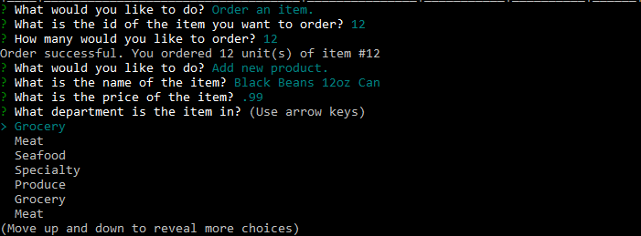

# Bamazon

Need to have an system that can be run anywhere, even in some hinterland with only a 28bps Modem connection?  Bamazon is your answer. Bamazon prides itself in allowing buisnesses to sell things to people who think GUI's are just overrated.  If you have a customer that is just absolutly adverse to any decoration at all, Bamazon.  If you have a customer that is trying to reach you from a modem using a low quality phone line from the Central African Republic, Bamazon.  We are there for all your text based ordering needs.
Bamazon is the greatest command line interface for ordering and tracking inventory.   
Customers can create secure accounts using there email,   
  
and then find dozens of things to buy.  
  
Thier purchases are tracked by our software and our soothsayers know exactly where and how to ship and charge your customers...

It's great for customers and managers alike.  Managers can install an additional program to do wonderful things like order products,   
  
add new products,  
  
view inventory,  
  
review orders from customers and by managers,  
  
and update products.  
  

Supervisors get access to all the same functionality of a manager and have the additional ability to add departments to the buisness   
  
and view sales totals.  
  

It's everything you can think of and more.  Call Bamazon to start today! 1-800-555-2368 
