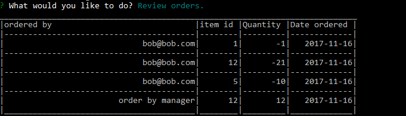

# Bamazon

Need to have an antiquated system that can be run on a 286 and with a 28bps Modem?  Bamazon is your answer. 
Bamazon is a command line interface for ordering and tracking inventory. Create your account,  

and then find dozens of things to buy.

It's great for customers and managers alike.  Managers can install an additional program to do wonderful things like order products,  

add new products,

view stock,

review orders,

and update products.

Supervisors get all the powers of a manager and additional abilities to add departments to the buisness  

and view sales totals.

It's everything you can think of and more. 
